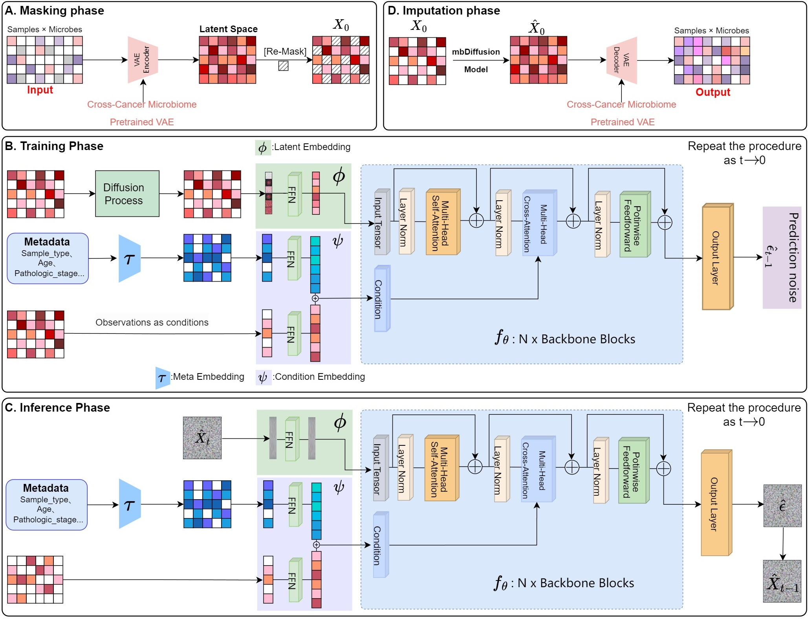

# Imputing Microbiome Data using Conditional Diffusion Generative Models

## Overview
In this paper, we proposed a masked conditional diffusion model with pre-trained variational autoencoder (VAE) for microbiome data imputation. At the implementation level, our approach integrates multiple heterogeneous cancer microbiome datasets through a pre-training and fine-tuning strategy, enabling effective cross-dataset information exchange. The framework combines observable data with multimodal metadata to condition the diffusion model throughout the denoising process. Experimental results across three cancer types (STAD, COAD, HNSC) from two tissue origins (solid/blood) demonstrate that both transfer learning and enriched conditioning contribute to significant improvements in model performance and stability.

## Installations
- Windows
-  NVIDIA GPU (both pretrained VAE and trained mbDiffusion on a single Nvidia GeForce RTX 3090)
-  `pip install -r requiremnts.txt`

## Data
All the datasets used in this paper can be downloaded from url：[https://zenodo.org/records/15233051](https://zenodo.org/records/15233051)

## Data format
- `bacteria.WXS.*.txt`: Source file of microbial sequencing data from cancer patients.
- `metadata.WXS.*.txt`: Source file of metadata from cancer patients.

## Data preprocessing
If you wish to perform data preprocessing, you can run the script in the Jupyter folder.

## Training mbDiffusion
``python main.py``

## Contact details
If you have any questions, please contact shixinyuan217@aliyun.com and minwenwen@ynu.edu.cn.
